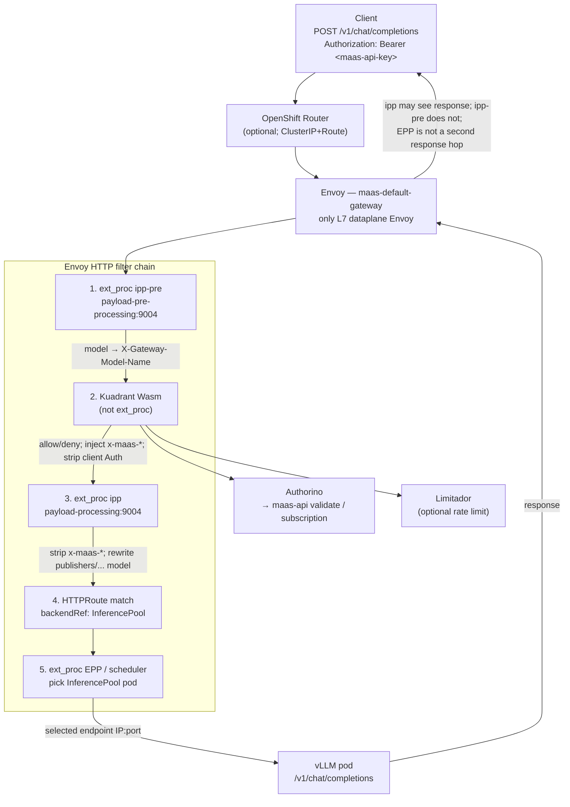
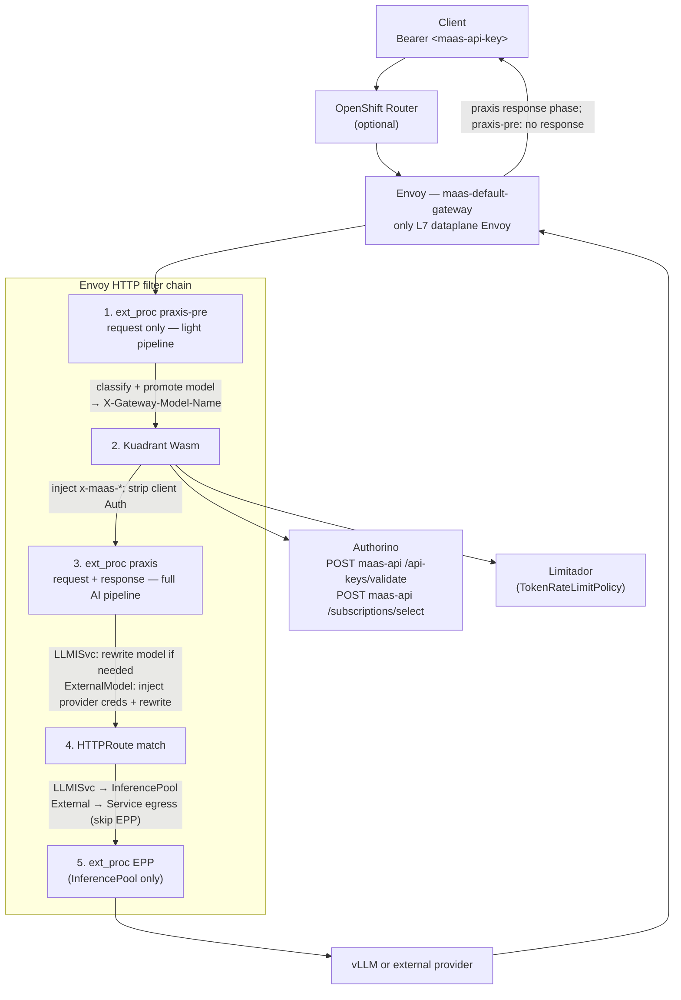
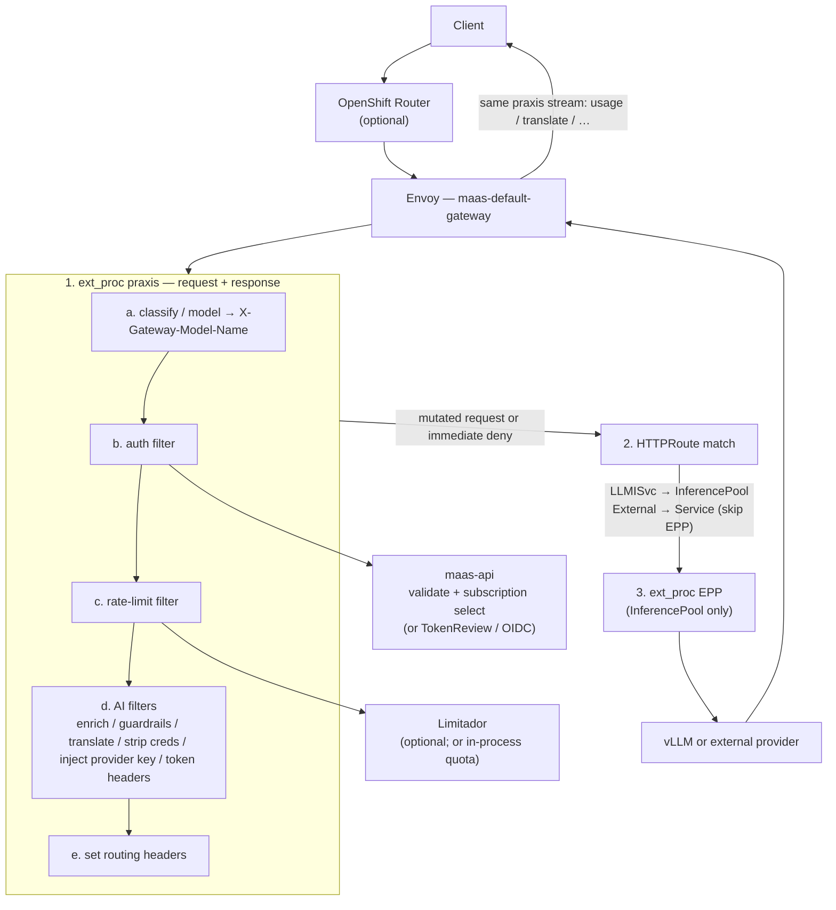
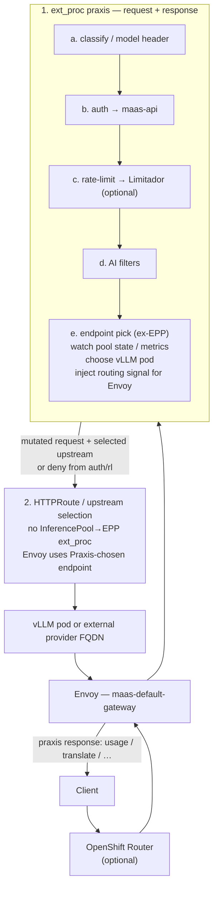
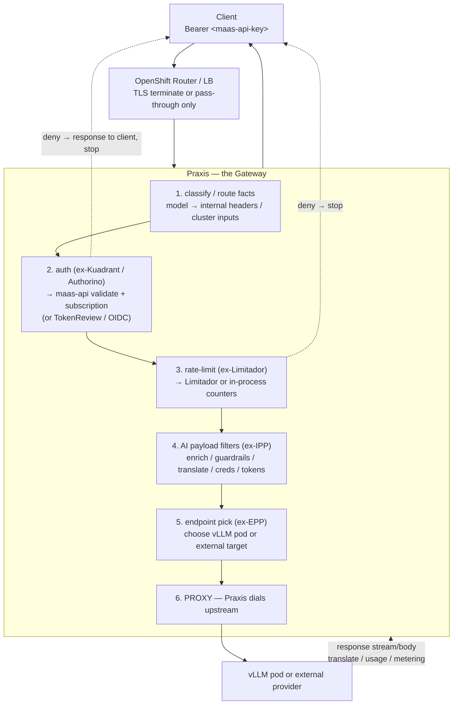

# Praxis dataplane evolution

This document describes how the MaaS AI Gateway request path evolves from
today's IPP + Kuadrant stack toward Praxis as the full AI gateway.
It is an evolution map for the **dataplane request path**, not a
deployment-topology ADR — see [DESIGN.md](../DESIGN.md) for operator /
controller ownership.

Source notes:
[Praxis evolution (gist)](https://gist.github.com/aslakknutsen/ff7f9a7fc206b0706974a7756054e56d).

## Stages at a glance

| Stage | Envoy role | Auth / rate limit | AI filters | Endpoint pick |
| --- | --- | --- | --- | --- |
| Current (IPP) | Only L7 dataplane | Kuadrant Wasm → Authorino / Limitador | `ipp-pre` + `ipp` ext_proc | InferencePool EPP ext_proc |
| Praxis for 3.6 | Only L7 dataplane | Kuadrant Wasm (unchanged) | `praxis-pre` + `praxis` ext_proc | InferencePool EPP ext_proc |
| Post 3.6 | Only L7 dataplane | Moved into Praxis pipeline | Single `praxis` ext_proc | InferencePool EPP ext_proc |
| Praxis + EPP | Only L7 dataplane | In Praxis | In Praxis | In Praxis (no EPP hop) |
| Praxis complete | Router / LB only | In Praxis | In Praxis | In Praxis; Praxis proxies upstream |

Throughout every Envoy-based stage there is still **one** Gateway Envoy
instance on the path. Extra hops are gRPC ext_proc (or Wasm) side calls from
that Envoy, not additional Envoy proxies.

---

## Current architecture (IPP)

**What each hop does (LLMISvc):**

1. **ipp-pre** — read body `model`, set `X-Gateway-Model-Name` (mostly header
   extract for on-cluster LLMISvc).
2. **Kuadrant Wasm** — auth via Authorino (may call maas-api for API key,
   subscription, model access); optional Limitador; inject `x-maas-*`
   identity headers; strip/replace client `Authorization`.
3. **ipp** — strip `x-maas-*` and client auth leftovers; rewrite
   `publishers/...` body model → bare name; no provider API-key injection
   for on-cluster.
4. **HTTPRoute** — match path / publisher headers; backend is an
   **InferencePool**, not a normal Service.
5. **EPP** — pick best pod in the pool (load / KV-cache / queue aware).
6. **Proxy** — Envoy forwards HTTP to the chosen pod.

---

## Praxis for 3.6

Same Envoy filter ordering as today; IPP binaries become Praxis profiles.

**3.6 delta vs current:** filter roles stay the same; `ipp-pre` / `ipp` are
replaced by `praxis-pre` / `praxis`. Kuadrant and EPP remain side calls from
Envoy. ExternalModel routes skip EPP and backend to an egress Service.

---

## Praxis + Kuadrant post 3.6

Auth and rate limiting move into the Praxis filter pipeline. Kuadrant Wasm
drops out of the hot path. Envoy still owns routing + EPP.

---

## Praxis + Kuadrant + EPP

Endpoint selection moves into Praxis. InferencePool → EPP ext_proc is gone;
Envoy sends traffic to the upstream Praxis selected.

---

## Praxis complete

Praxis becomes the gateway (e.g. Pingora + AI filters). Envoy is no longer
on the AI request path; the OpenShift Router / LB only terminates or
passes through TLS.

---

## How this relates to this repository

| Concern | Owner today / near-term | Evolution target |
| --- | --- | --- |
| ExtProc install + ExternalModel control plane | `ai-gateway-controller` (this repo) | Unchanged through Envoy stages; dataplane binary becomes richer |
| Auth / subscription / API keys | Kuadrant → Authorino → maas-api | Fold into Praxis pipeline post 3.6 |
| Rate limits | Limitador via Kuadrant | Optional Limitador or in-process in Praxis |
| AI payload processing | IPP → Praxis ext_proc (3.6) | Same filters, fewer Envoy hops over time |
| InferencePool scheduling | EPP ext_proc | Absorbed by Praxis, then Praxis-as-gateway |

For control-plane deployment topology (operators, tenant fan-out, IPP vs
Praxis selection), see [DESIGN.md](../DESIGN.md).
